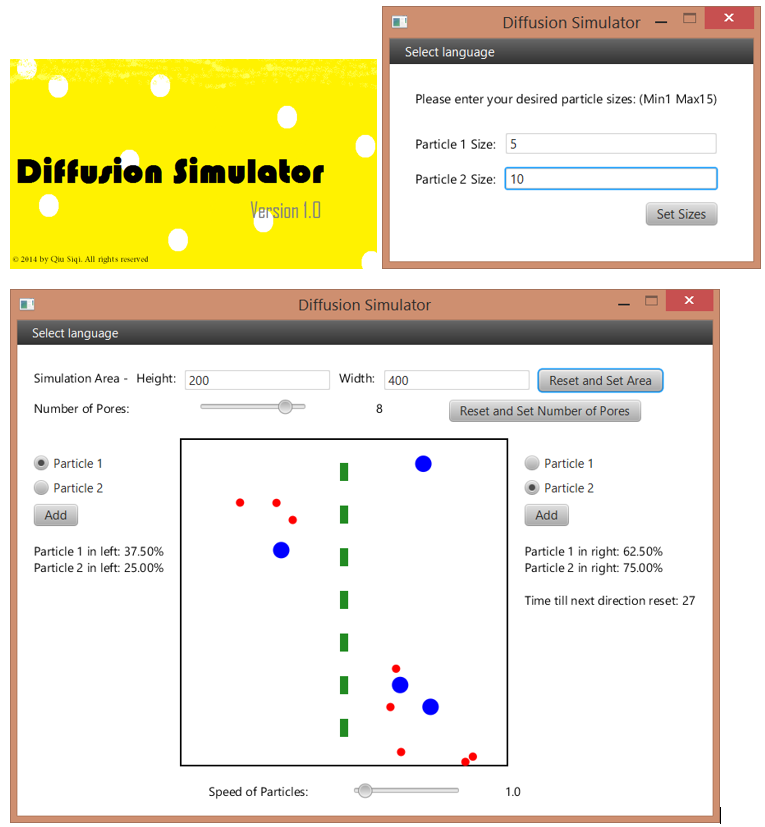

This computer simulation is meant to present the concepts of diffusion. 

Diffusion refers to the process by which molecules intermingle as a result of their kinetic energy of random motion. There is a net movement from the region with a higher concentration to the region with a lower concentration, eventually achieving a state where concentrations fluctuate close to equilibrium (Equal concentration).

This simulation:
•	Shows the behavior of molecules in constant random motion.
•	Allows users to see how changing the area, number of pores in the “membrane” and speed of particles affect the rate of diffusion.
•	Allows users to understand that only small molecules diffuse across a partially permeable membrane by allowing variation in particle size.
